# Klasse1

## Git

Git ist ein sehr leistungsstärker Werkzeug für Softwareentwickler.

[http://https://en.wikipedia.org/wiki/Git](https://en.wikipedia.org/wiki/Git)

[https://git-scm.com/book/en/v2/Getting-Started-Git-Basics](https://git-scm.com/book/en/v2/Getting-Started-Git-Basics)

## Das Thema des Kurses

- fortgeschrittene und praktische DSP-Techniken
- [gen~] objekt

### Warum braucht man gen~?

>General
>
- You want to create processes that can't be efficiently achieved with ordinary Max/MSP/Jitter objects
- You want to program visually at a low level while getting the performance of compiled C
- You want to use a concise text based expression language (codebox) rather than visual programming or coding in GLSL
- You want to avoid having to compile separate windows and macintosh versions or 32- and 64-bit binaries
- You want to design new algorithms and see or hear them immediately
- You want to design an algorithm that can run on Windows and Mac

>Examples
>
- arbitrary **new oscillator** and filter designs using single-sample feedback loops with gen~
- **reverbs** and physical models using networks of short feedback delays with gen~
- **sample-accurate buffer~ processing** such as waveset distortions with gen~
- **efficient frequency-domain processing** such as spectral delays using gen~ inside pfft~

[gen~] Objekt ermöglicht die Entwicklung eines Max/MSP Objekts ohne C++ oder C.

## Die Beschränkung der Max-Programmierung

### präzise Feedback ist unmöglich
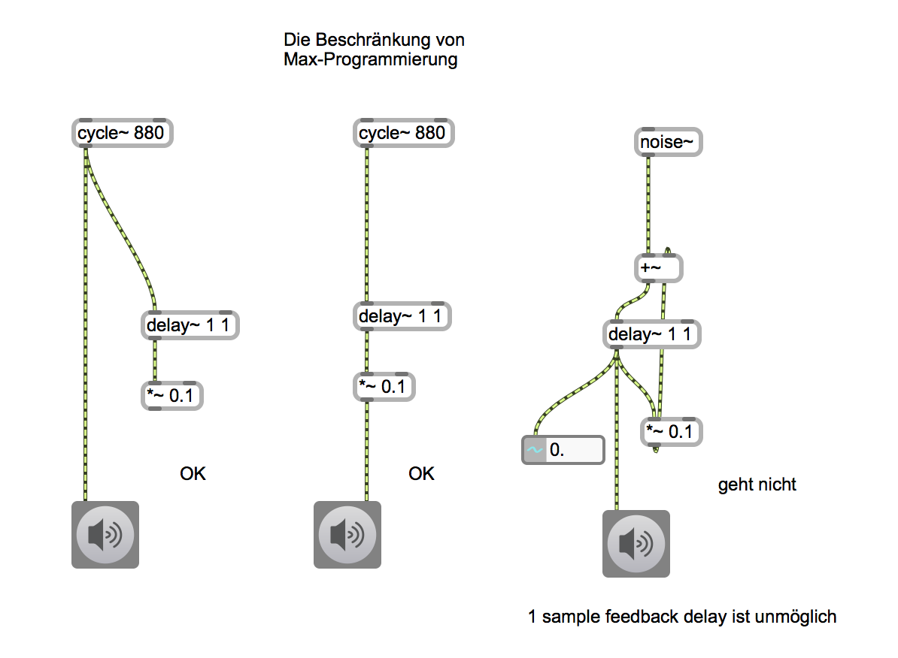

### Feedback ist abhängig von SIGNAL VECTOR SIZE
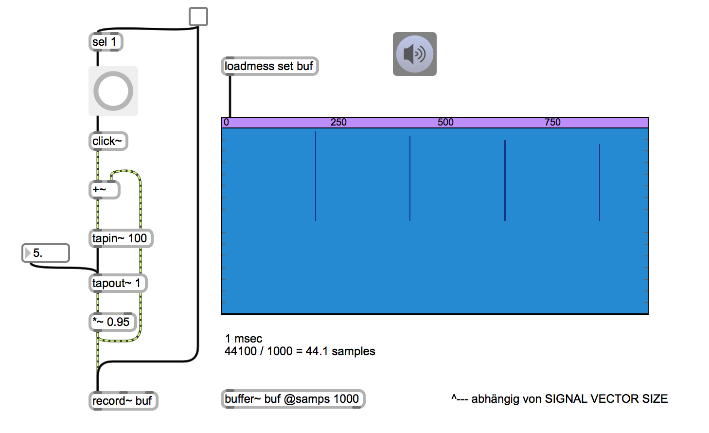

### Das Geheimnis hinter send~ und receive~ 
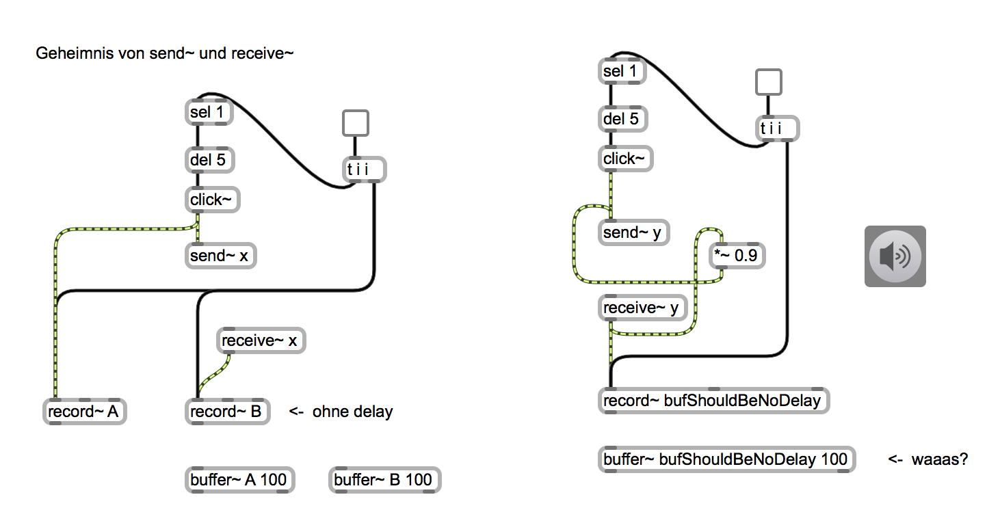

#### Warum ist feedback so wichtig?

- Feedback ist z.B. sehr wichtig für
	- Karplus-Strong Synthese = Kurzer Puls + Feedback Delay
	- Flanger-Effekt = Feedback Delay mit einer dynamischen DT
	- Digital-Reverb = Mehrere Feedback Delays
	- Filter = 1 Sample Delay + Addition usw
	- Feedback-FM = Modulator benötigt 1-Sample Feedback

	
### Kann man unregelmäßige Pulse erzeugen?

mit Kontrollobjekten (Präzision = 1 msek.)

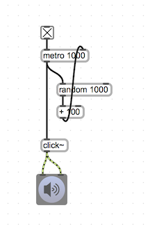

aber Signalobjekten?

## Die Lösung

Das gen~ Objekt

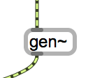

### Die Lösung für das Feedback-Problem
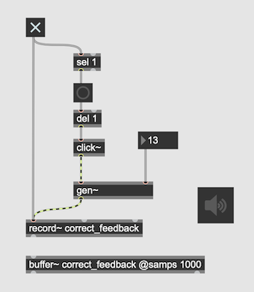
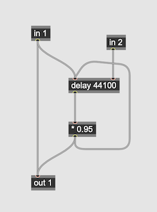

### Die Lösung für das Puls-Problem
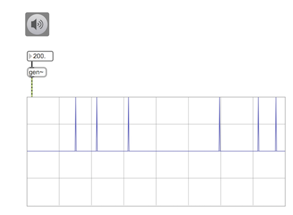
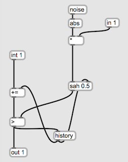

## Ein einfaches Beispiel mit gen~

### Das Problem

rand~ erzeugt ein lineares Signal.
Wie kann man rand~ mit exponentiellen Kurven verwirklichen?

### Die Lösung
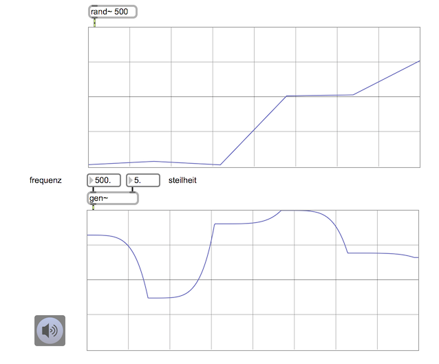

### C / C++ und gen~

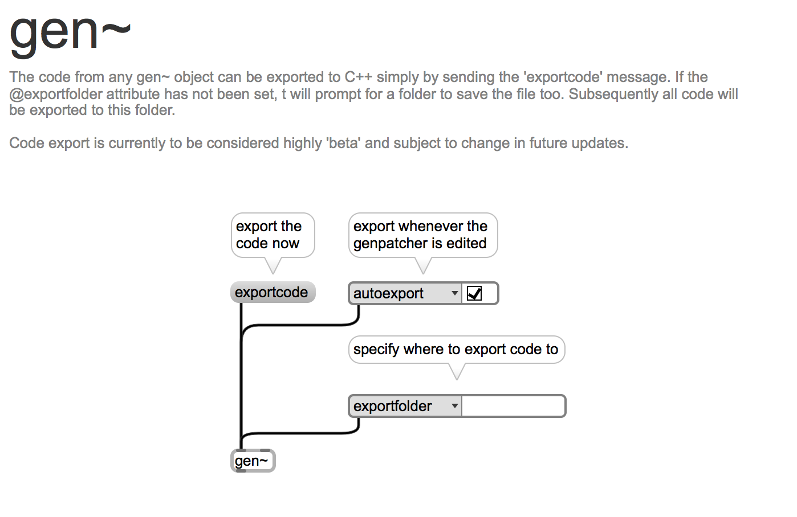

