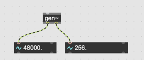
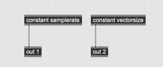
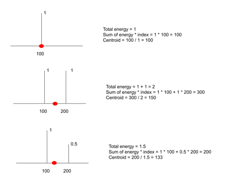
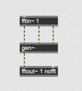
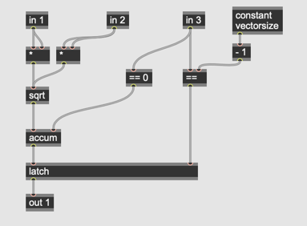
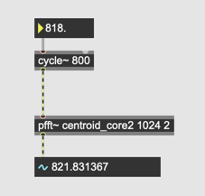
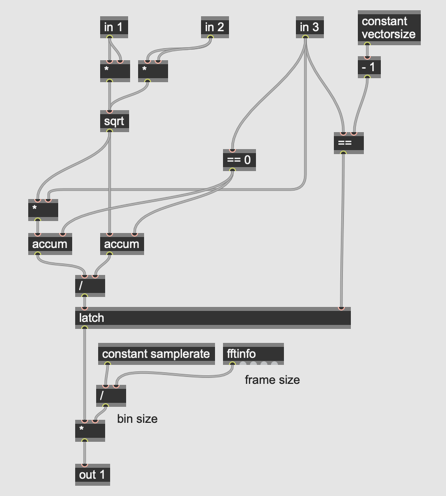

# Klasse10

### FFT und gen~

#### Relevante constants in gen~

#### Centroid

##### Centroid

##### Energy Sum

main  

pfft  

gen  

##### Bin -> Freq

main  

pfft  

gen  

#### Spectral Snapshot

#### Spectral Feedback Delay

