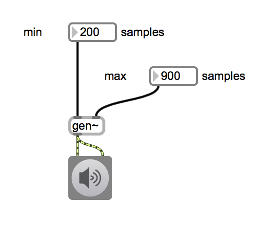
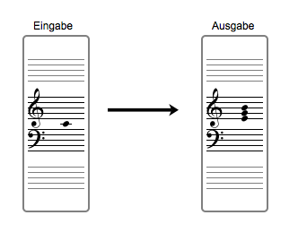
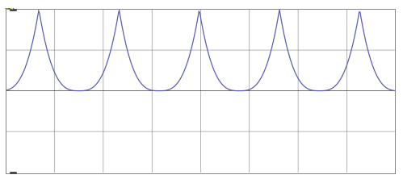
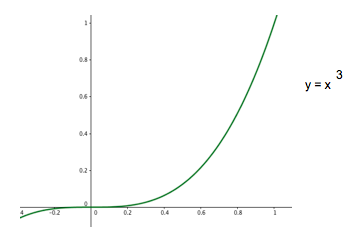

# Klasse11

## Modeltest #1

Programmieren Sie ein gen~ Patch, das unregelmäßige Impulse generiert. Im Patch kann der Bentuzer mit zwei number-boxes (min und max) den Bereich der Abstand zwischen den Impulsen einstellen. Die Dauer jedes Impulses muss immer 1 Sample und die Amplitude muss immer 0.8 sein. (10 min)

## Modeltest #2 / Randomisierung mit einer Regel

Programmieren Sie einen Melodieerzeuger, der endloss in G-Dur improvisiert. Die Nutzung von großen Septimen ist verboten.

(10 min)

## Modeltest #3 / Harmonizer

Programmieren Sie einen Harmonizer mit tapin~ und tapout~, der den folgenden Effekt anbietet. (10 min)

## Modeltest #4 / Entwicklung eines Oszcillators 

Programmieren Sie ein gen~ patch, das ein "Potenzdreieck" erzeugt.
Die Kurve der Welleform muss mit einer Potenzfunktion y = x^3 verwicklicht werden.

