# Klasse 2

Das erste sinnvolle DSP Programm mit gen~

## powerrand~

## Patch

### Schritt 1

**phasor:** erzeugt Sägezahn

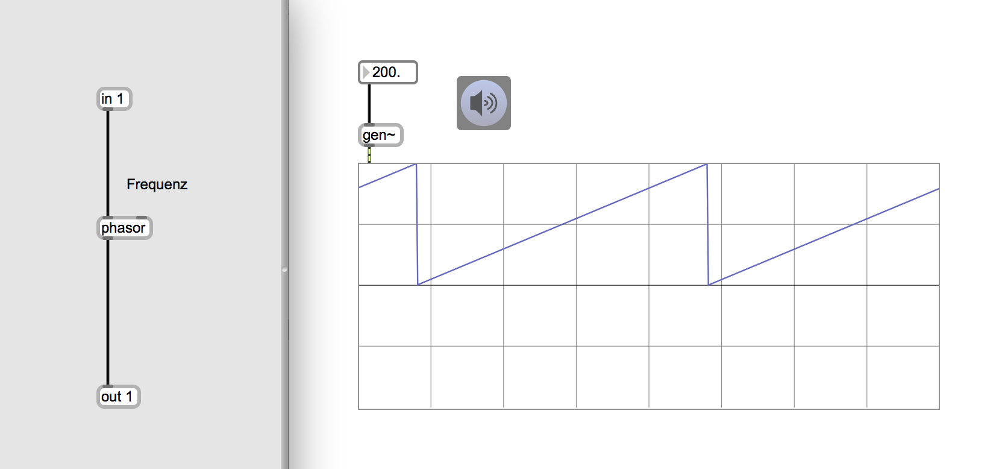

### Schritt 2

**delta:** Differenz zwischen dem jetzigen Wert und dem letzten Wert

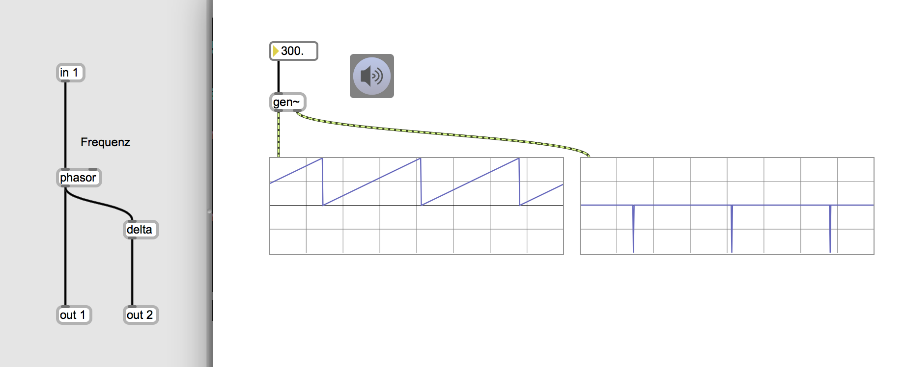

### Schritt 3
**<~ 0:** erzeugt 1, wenn das eingegebene Singal kleiner als 0 ist.

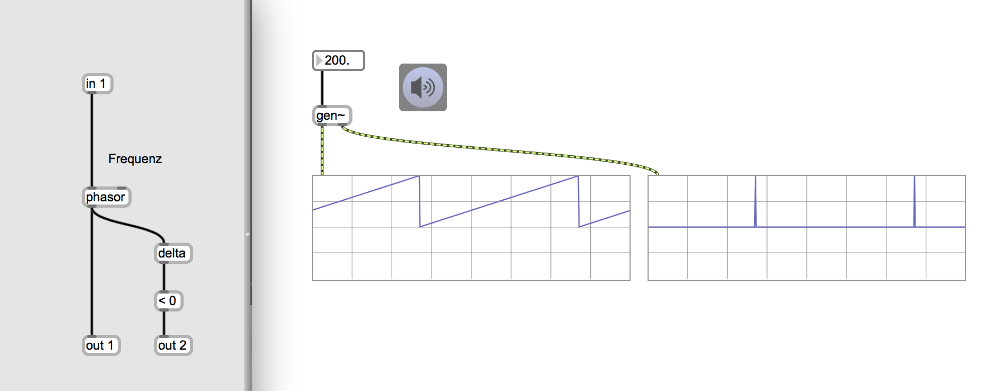

### Schritt 4
**noise:** erzeugt randomisierten Werte zwiscehn -1 und 1

### Schritt 5

**sah:** sample and hold. Das Argument = die Schwelle.

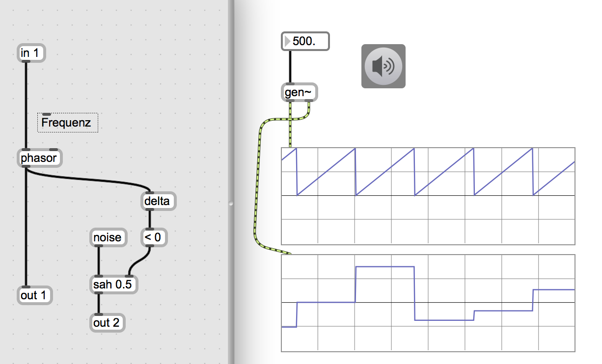

### Schritt 6

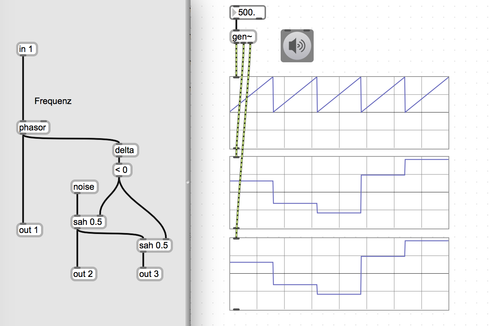

### Schritt 7
**history:** 1 Sample Verzögerung.

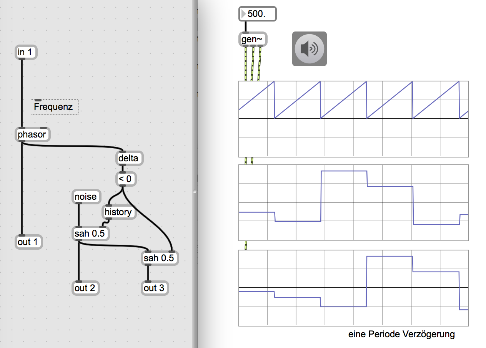

### Schritt 8

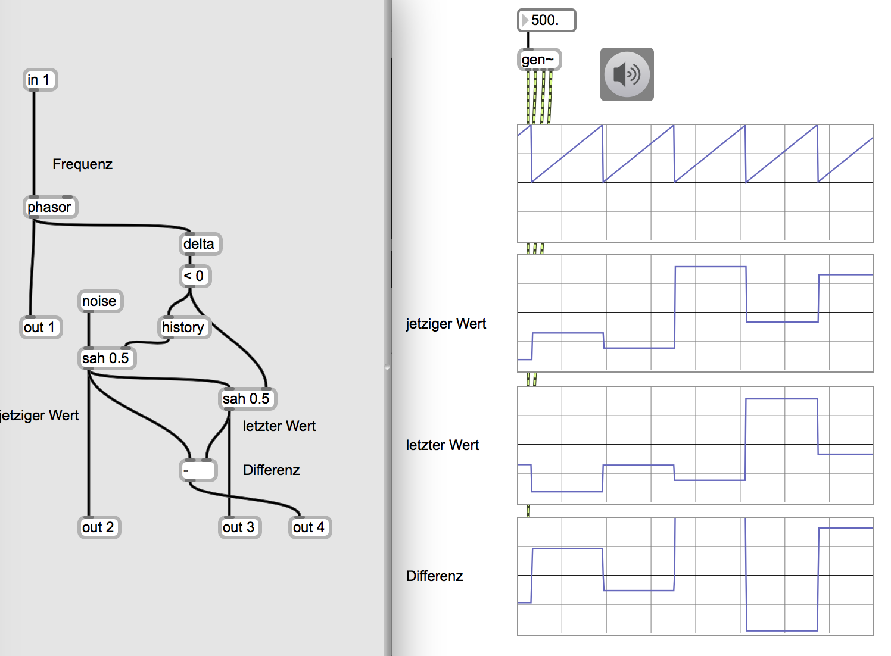

### Schritt 9

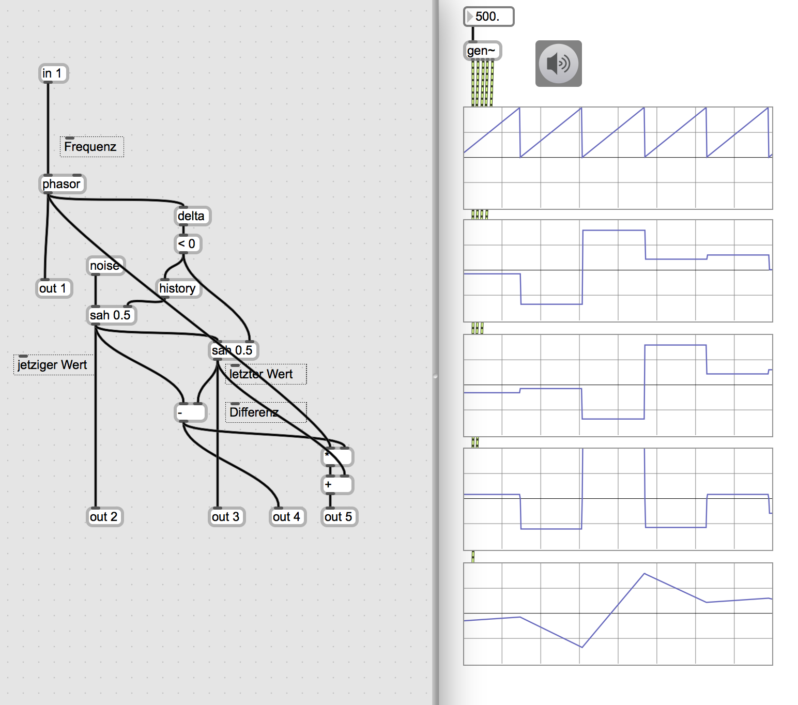

### Schritt 10

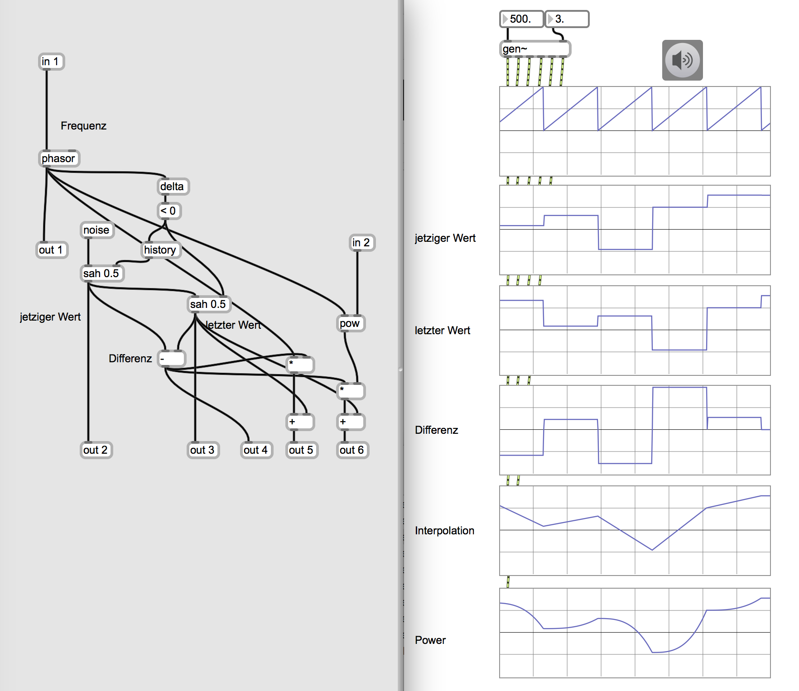

### Schritt 11

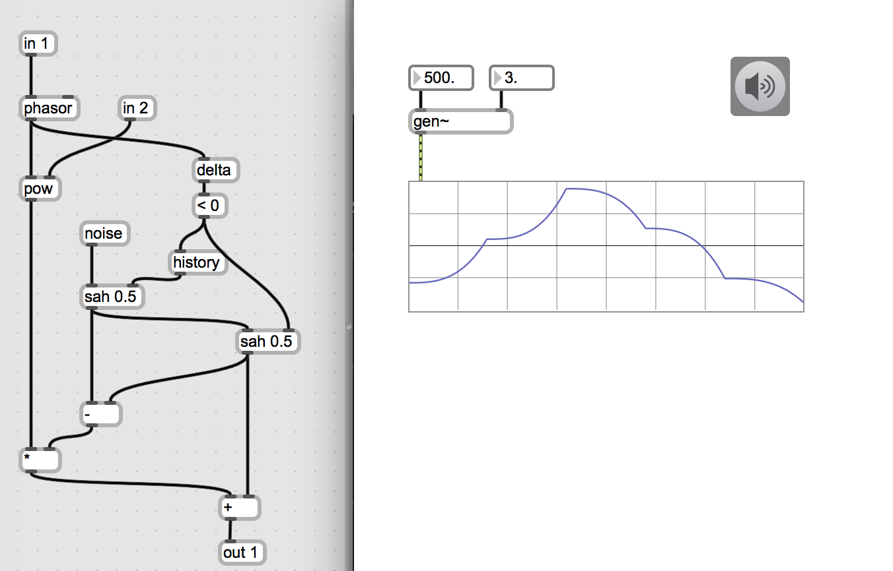

### Schritt 12

gen als Datei
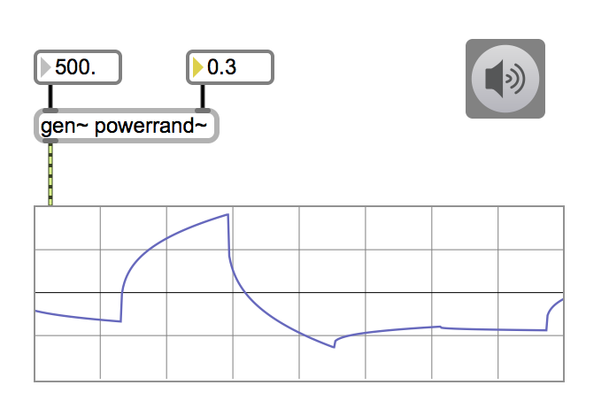

