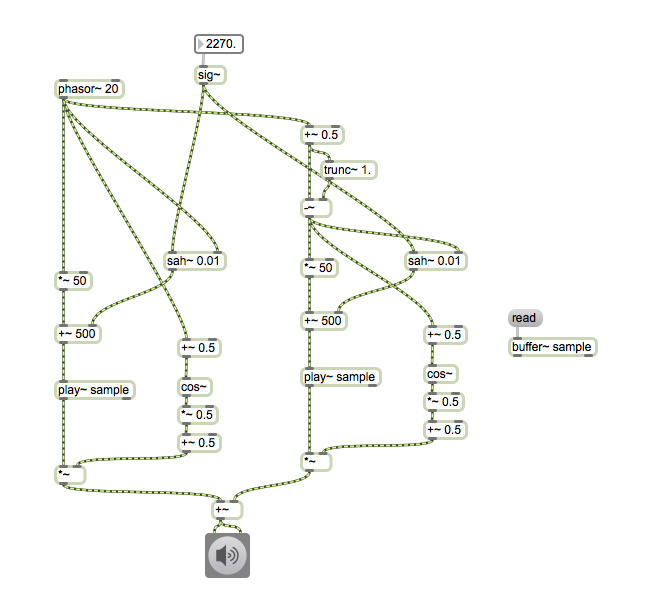
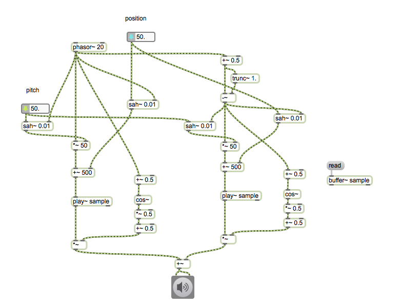
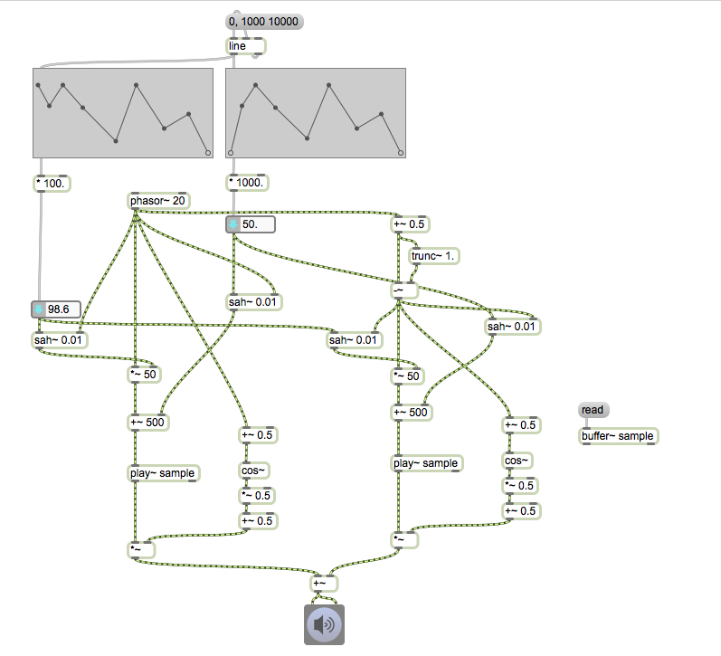
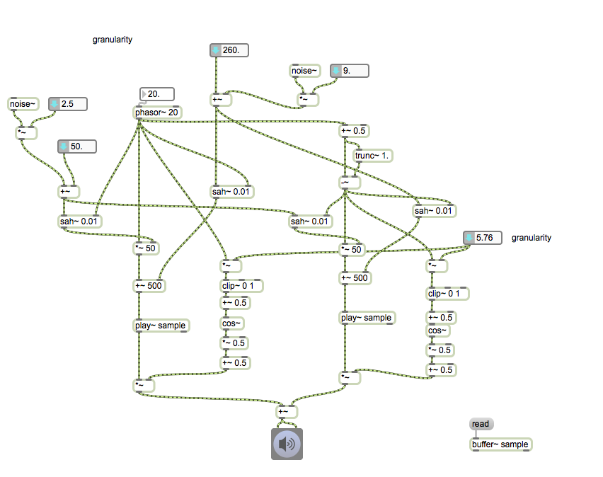
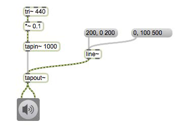
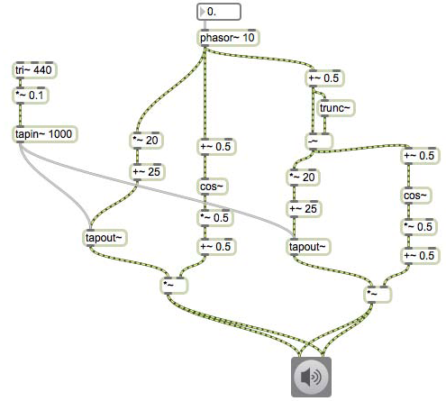

# Klasse3

## Granularsynthese (Recap)

---

---

---

---

---

---

---

---

---

---

## Anwendung von Granularsynthese

### Position

---
### Pitchshift

---
### Tonleiter

---
### Automation

---
### Randomisierung

---
### Granularität

## Pitch Shifter

### Delay

---
### Dynamische Delay-Time

---
### DT-Kontrol mit phasor~

---
### Fensterfunktion

---
### (OLA)Overlap and Add

---
### mit Live-Input

## AGS (Asynchronous Granular Synthesis)

Unregelmäßiger Phasor

---

---

---

## Granularsynthese - Weiterentwicklungsmöglichkeiten
### Unregelmäßige Impulse

---
### Verteilung

---

### Verteilung + Phasor

---
### Verteilung + Sample

---
### Verteilung + sample + Fenster

---
### Umgestaltung

## Glissonsynthese mit Sample

### Granular in Gen

### Glissonsynthese

