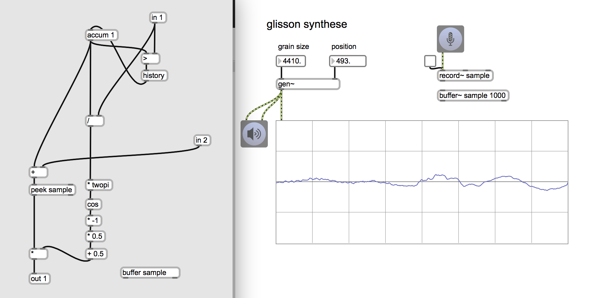

# Klasse3

## Particle synthesis mit gen~

- Glissonsynthese
- AGS (Asynchronous Granular Syntesis)
- Waveletsynthese
- FormantSynthese

## AGS (Asynchronous Granular Synthesis)

Unregelmäßiger Phasor

---

---

---

## Granularsynthese - Weiterentwicklungsmöglichkeiten
### Unregelmäßige Impulse

---
### Verteilung

---

### Verteilung + Phasor

---
### Verteilung + Sample

---
### Verteilung + sample + Fenster

---
### Umgestaltung

## Glissonsynthese mit Sample

### Granular in Gen

### Glissonsynthese

