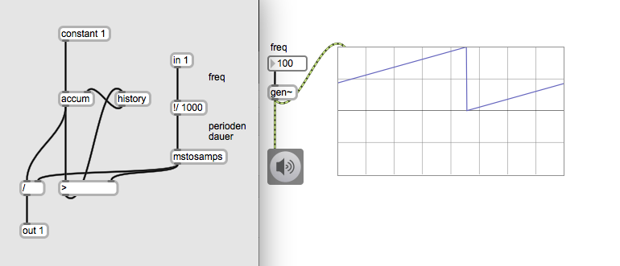
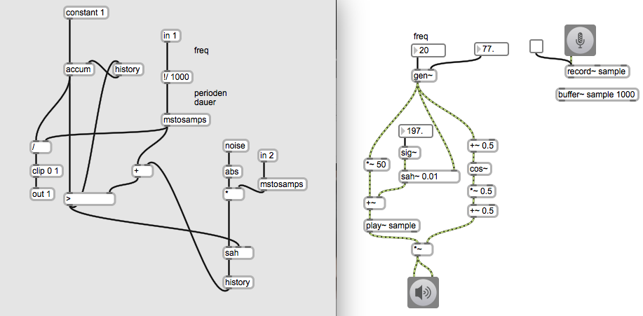
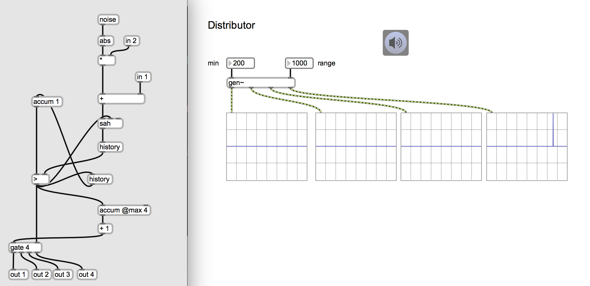
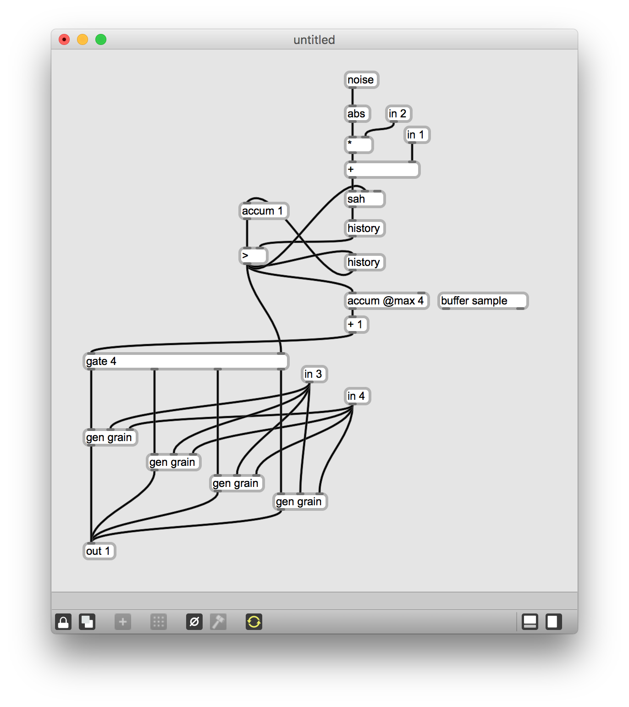
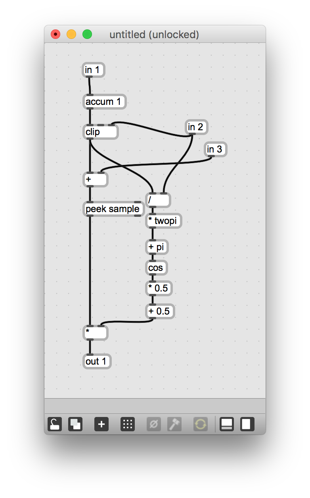

# Klasse3

## Particle synthesis mit gen~

[Except microsound](Klasse3/particle.pdf)

- Glissonsynthese
- AGS (Asynchronous Granular Syntesis)

### Glissonsynthese

#### Schritt 1

Sinus aus gen~

#### Schritt 2

interp und glissando

#### Schritt 3

param in

#### Schritt 4

range in

#### Schritt 5

grain size

#### Schritt 6

Fensterfunktion

#### Schritt 7

Mit waveform

#### Schritt 8

Mit Sample

## AGS (Asynchronous Granular Synthesis)

Unregelmäßiger Phasor

---

---

---

## Granularsynthese - Weiterentwicklungsmöglichkeiten
### Unregelmäßige Impulse

---
### Verteilung

---

### Verteilung + Phasor

---
### Verteilung + Sample

---
### Verteilung + sample + Fenster

---
### Umgestaltung

