# Klasse3

## Particle synthesis mit gen~ (1)

[Except microsound](Klasse3/particle.pdf)

### Glissonsynthese

#### Schritt 1

Sinus aus gen~

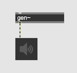

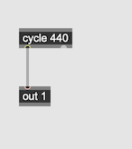

#### Schritt 2

interp und glissando

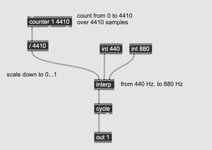

#### Schritt 3

param in

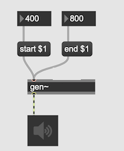

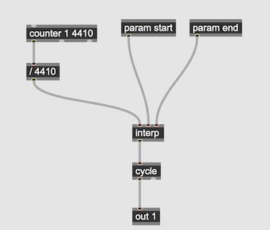

#### Schritt 4

range in

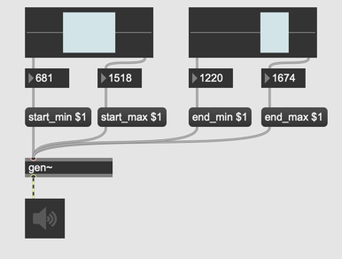

#### Schritt 5

grain size

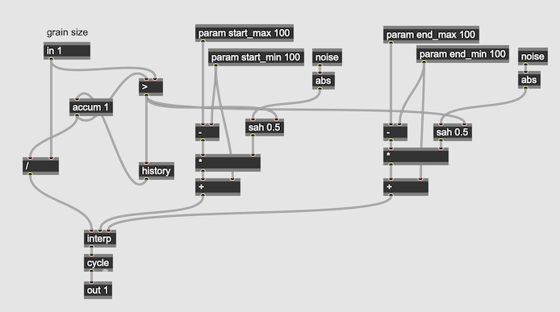

#### Schritt 6

Fensterfunktion

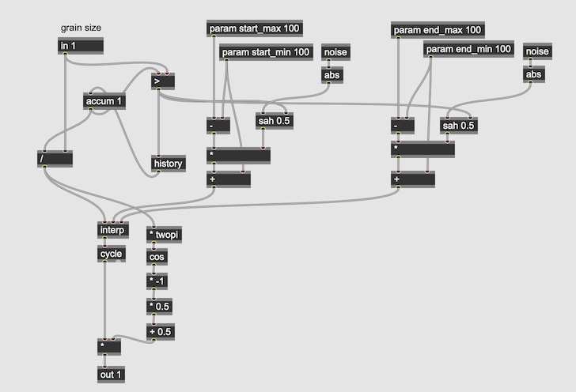
#### Schritt 7

Mit waveform

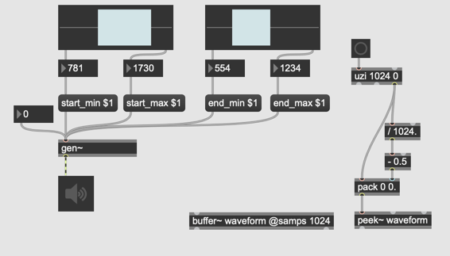

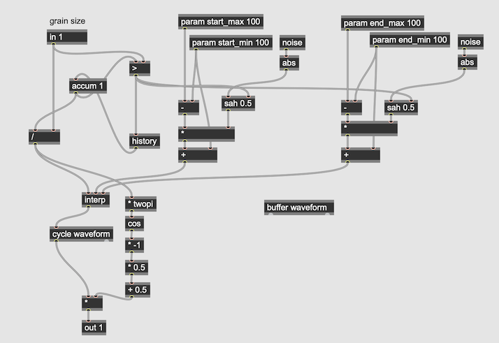

#### Schritt 8

Mit Sample

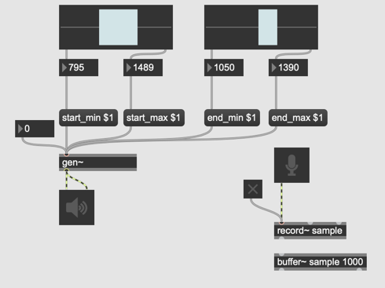

