# Klasse4

## Particle synthesis mit gen~ (2)

### AGS (Asynchronous Granular Synthesis)

#### Schritt 1

S￿ägezahn

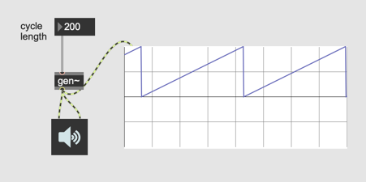
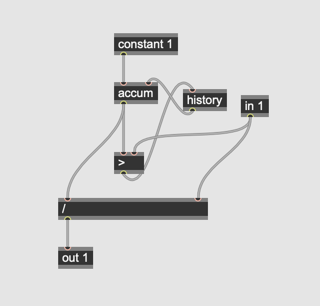

#### Schritt 2

Pause

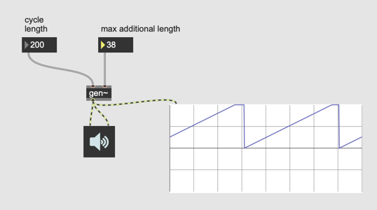
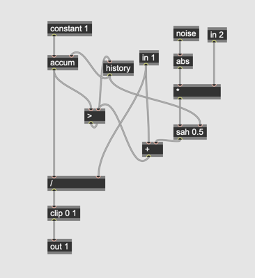

#### Schritt 3

Mit Sample

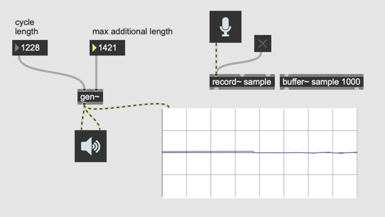
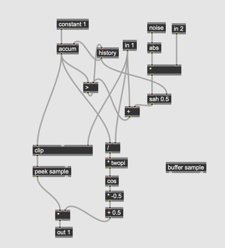

#### Schritt 4
Offset

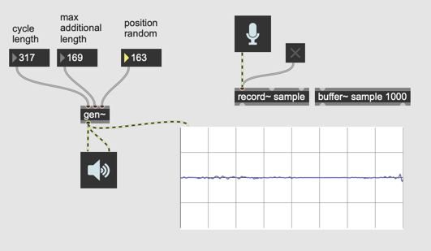
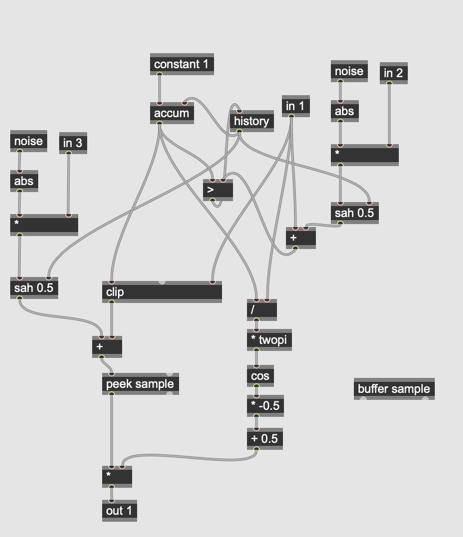

## Multi-Voice

### Problem 
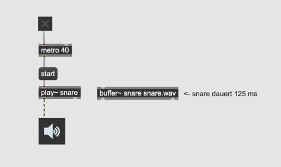

### L￿ösung
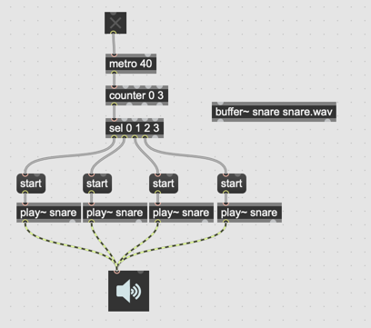

## Multi-Voice in gen~

### Verteilung

### Verteilung + Phasor

### Verteilung + Sample
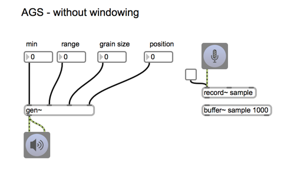
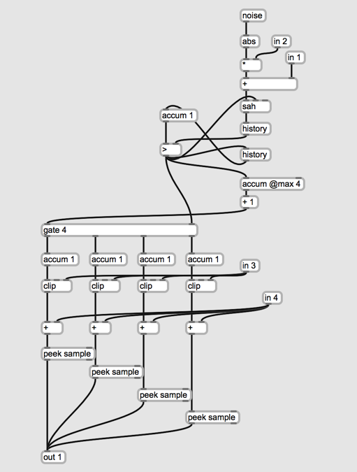

### Verteilung + sample + Fenster

### Patcher in gen~
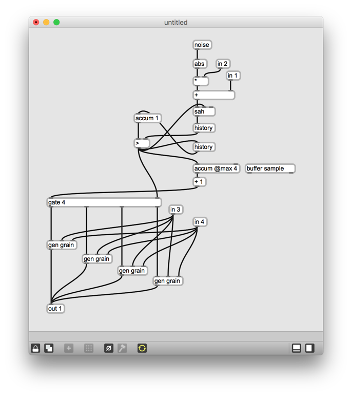
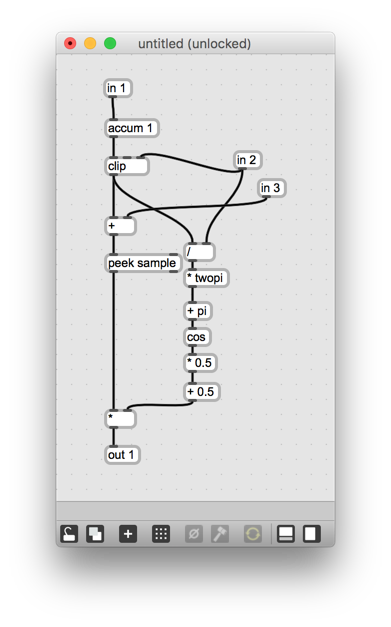

