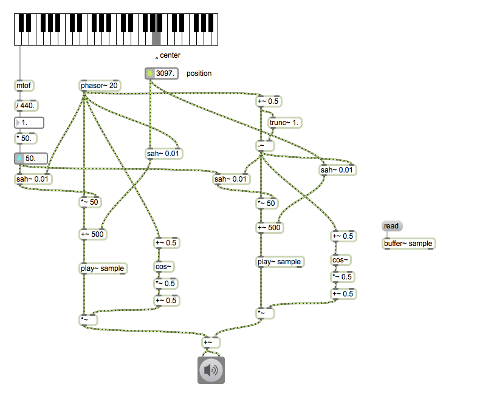
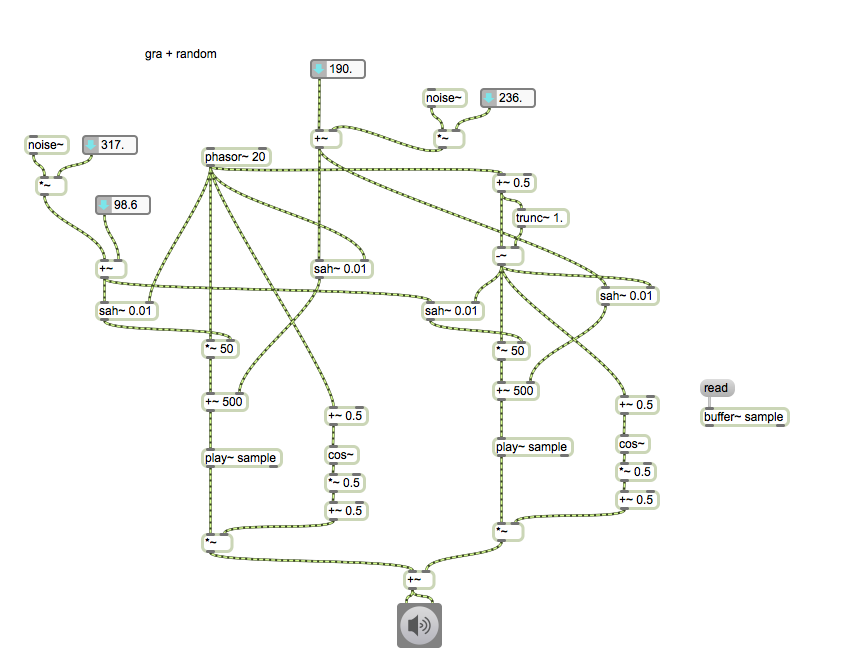
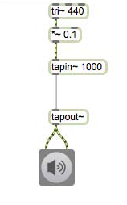
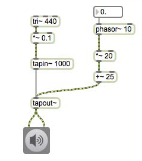
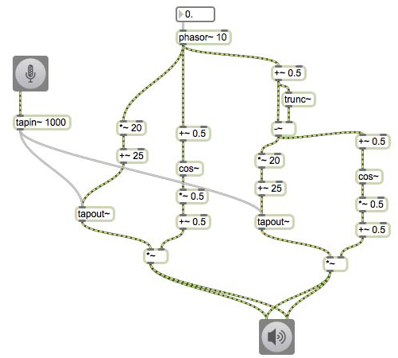

# Klasse4

## Anwendung von Granularsynthese

### Position

---
### Pitchshift

---
### Tonleiter

---
### Automation

---
### Randomisierung

---
### Granularität

## Pitch Shifter

### Delay

---
### Dynamische Delay-Time

---
### DT-Kontrol mit phasor~

---
### Fensterfunktion

---
### (OLA)Overlap and Add

---
### mit Live-Input

---
### Tonleiter

---
###  Harmonizer

