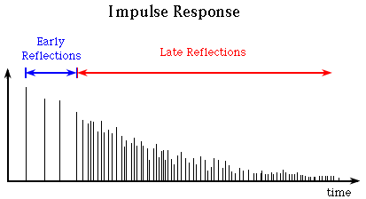
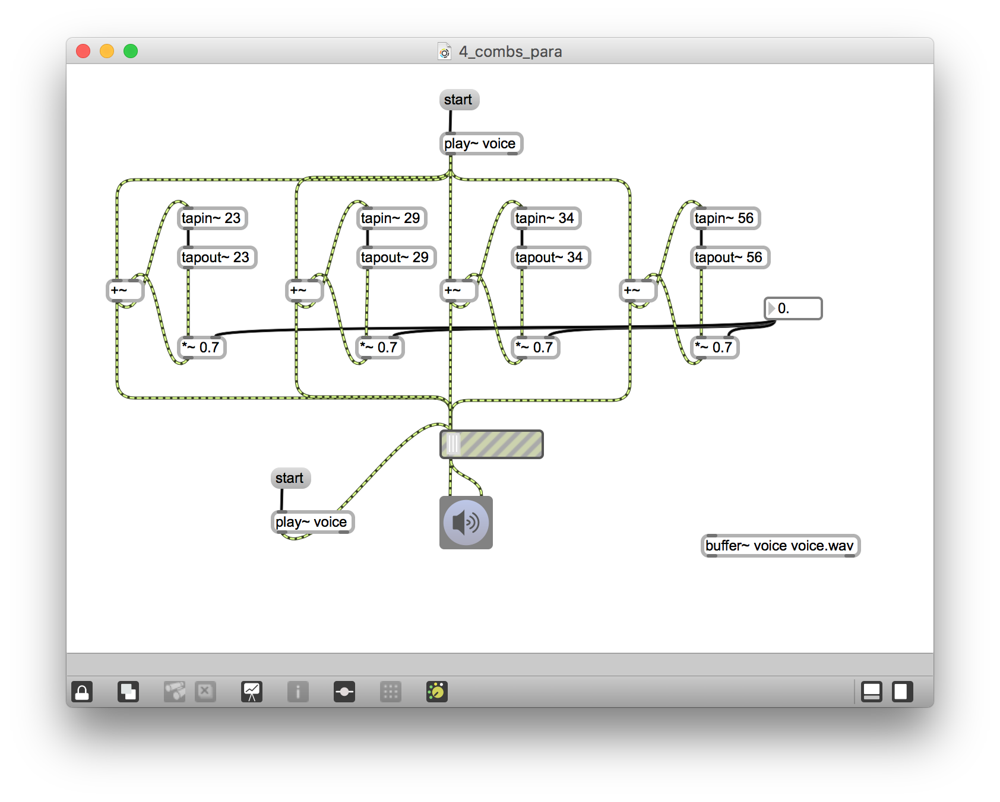
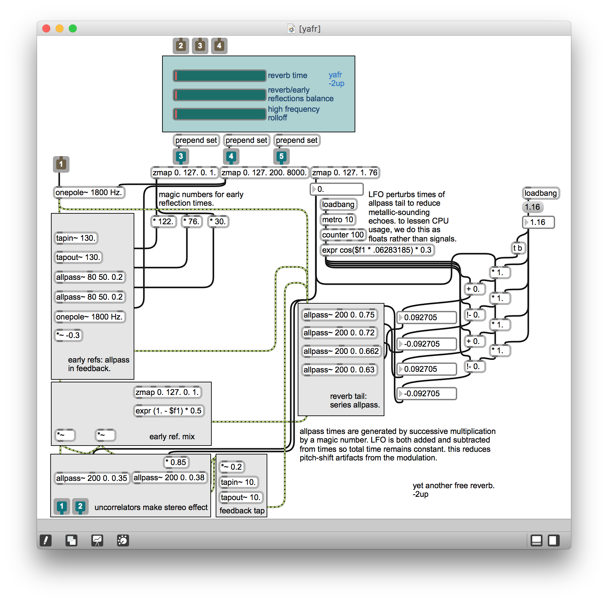

# Klasse5

## Tent map

### Modell

### gen~

### downsample + Unregelmäßigkeit

### Cubic-Interpolation

## Reverb

### Reverb 

- Early Reflections
- Late Reflections

### Delay

### Kammfilter

### Kammfilter + Phasenumkehr

### Allpass

### Vergleich

### Objekte - Kammfilter / Allpass

### Curtis Road's CMT, Reverbration Patches

For lush reverberation, it is necessary to interconnect a number of unit reverberators to create sufficient echo density so that the echoes fuse.

When unit reverberators are connected in **parallel**, their echoes add together. When they are connected in **series**, each echo generated by one unit triggers a series of echoes in the next unit, creating a much greater echo density. The number of echoes produced in series is the product of the number of echoes produced by each unit.

#### Parallel - Serial

### Manfred Schröeder Algorithmus

 

### Schröder Reverb

4 comb parallel

---
4 allpass parallel

-- 
4 allpass serial

--
4 comb parallel + 2 allpass

### Early Refelektion

### Verbesserter Schröder-Reverb

### High Frequency Rolloff = Lowpass

### Stereo Verbreitung

### Implementationsbeispiel 1 / rev4~

von Sack Settel

### Implementationsbeispiel 2 / rev1~

von  Sack Settel

### Implementationsbeispiel 3 / yafr 

### Implementationsbeispiel 4 / yafr2

