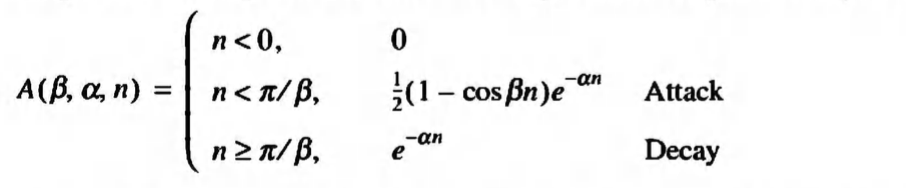
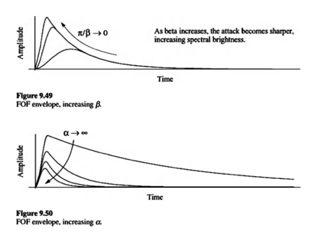
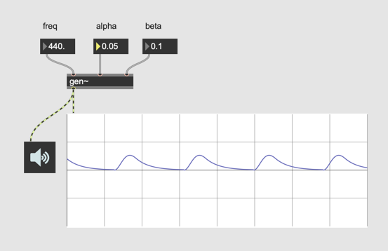
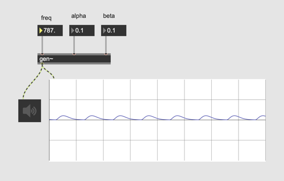
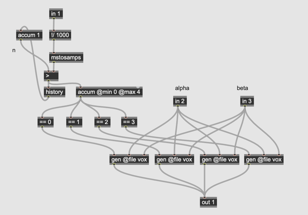
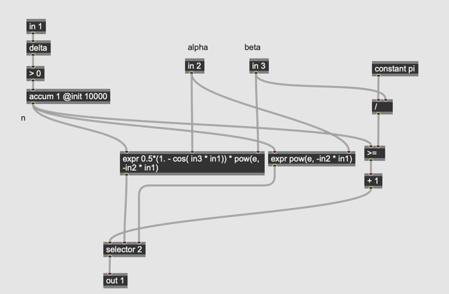
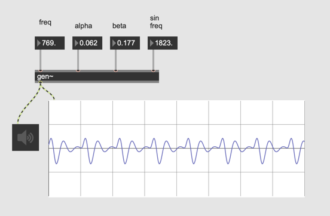
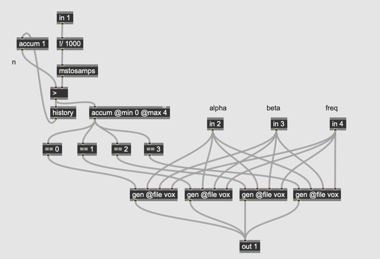
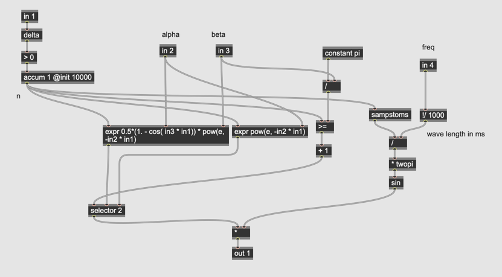

# Klasse5

## Particle synthesis mit gen~ (3)

### Formant wave-function synthesis (aka FOF / fonction d’onde formantique)
 
> FOF generates a stream of grains, each separated by a quantum of time, corresponding to a period of fundamental frequency

- Wellenform = Sinus
- H￿üllkurve

- n …  sample in time
- β … attack sharpness
- α … decay control

## Umsetzung in Gen~
## Schritt 1
H￿üllkurve

## Schritt 2

Multivoice

### Schritt 3

Synced-Sinus

