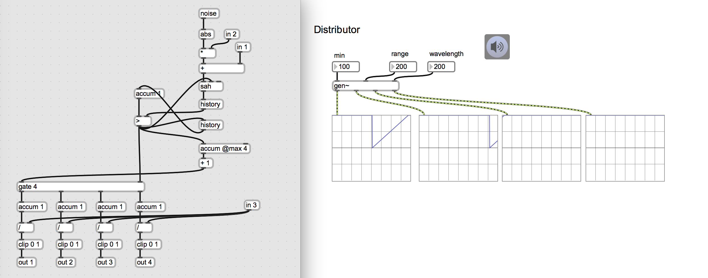
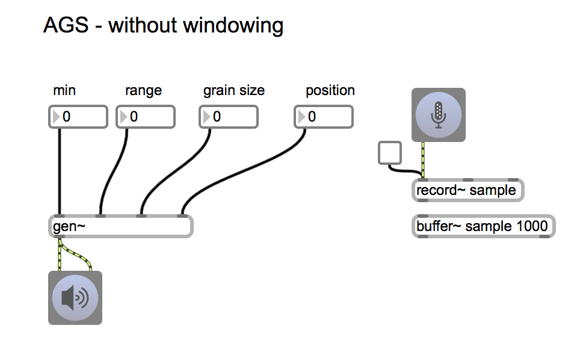
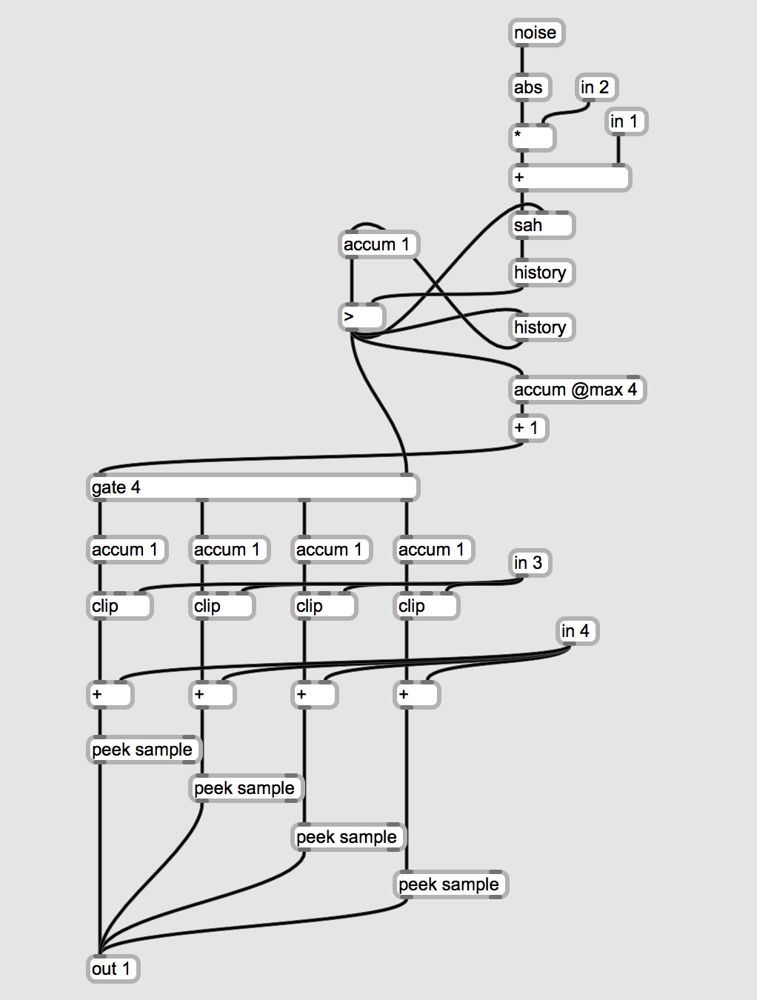
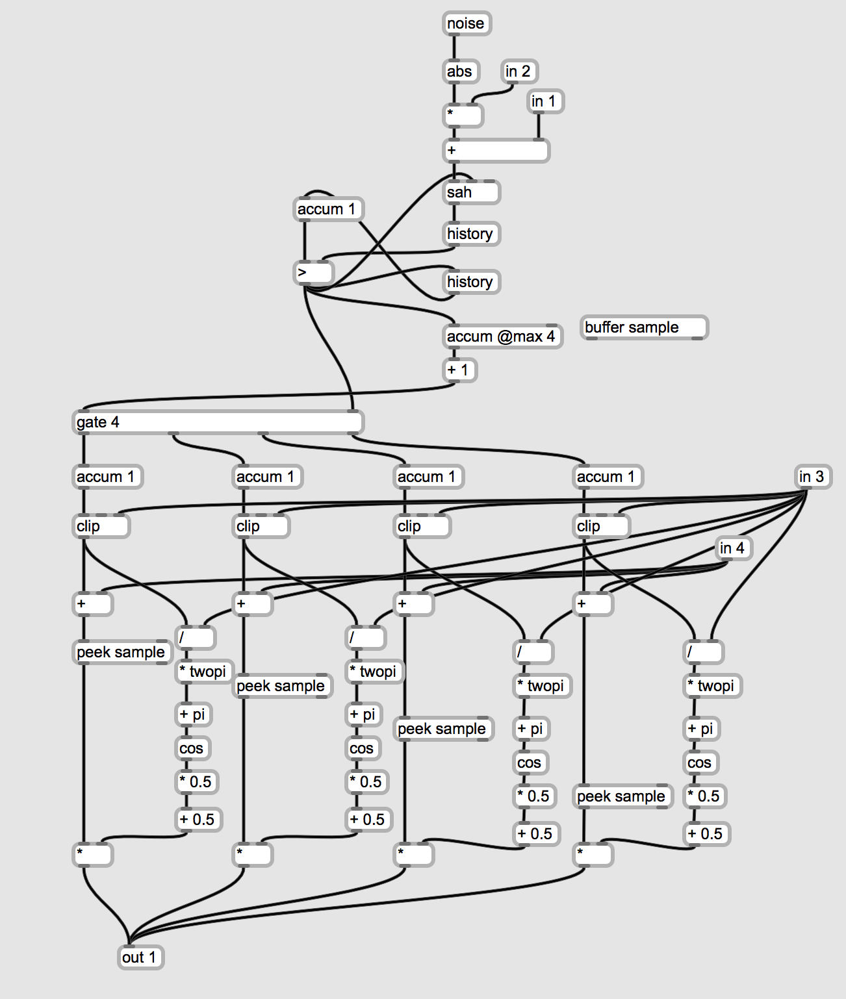

# Klasse6

## Granularsynthese - Weiterentwicklungsmöglichkeiten
### Unregelmäßige Impulse

---
### Verteilung

---

### Verteilung + Phasor

---
### Verteilung + Sample

---
### Verteilung + sample + Fenster

---
### Umgestaltung

## Glissonsynthese mit Sample

### Granular in Gen

### Glissonsynthese

