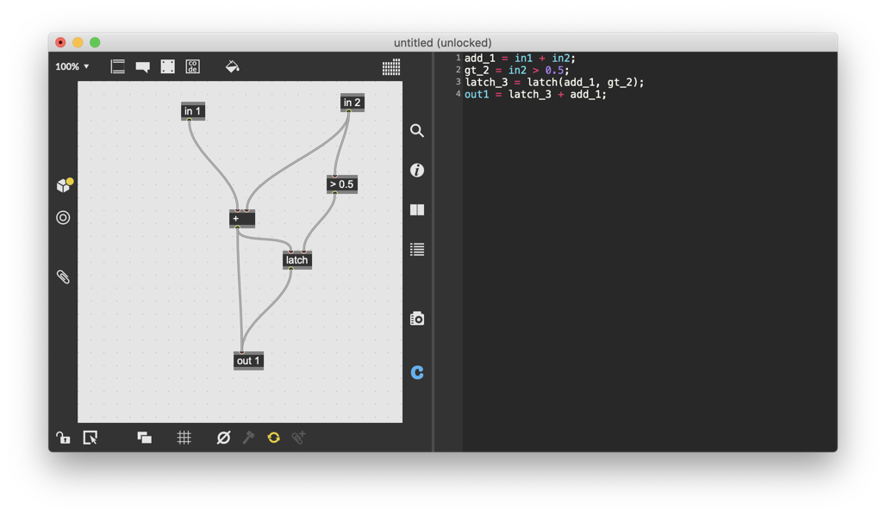
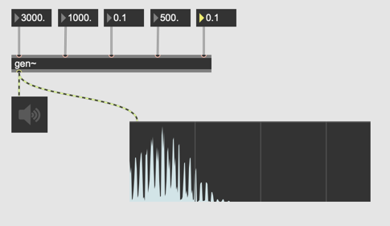
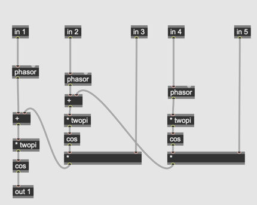
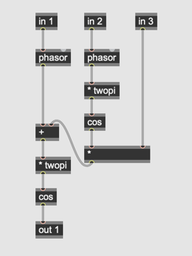
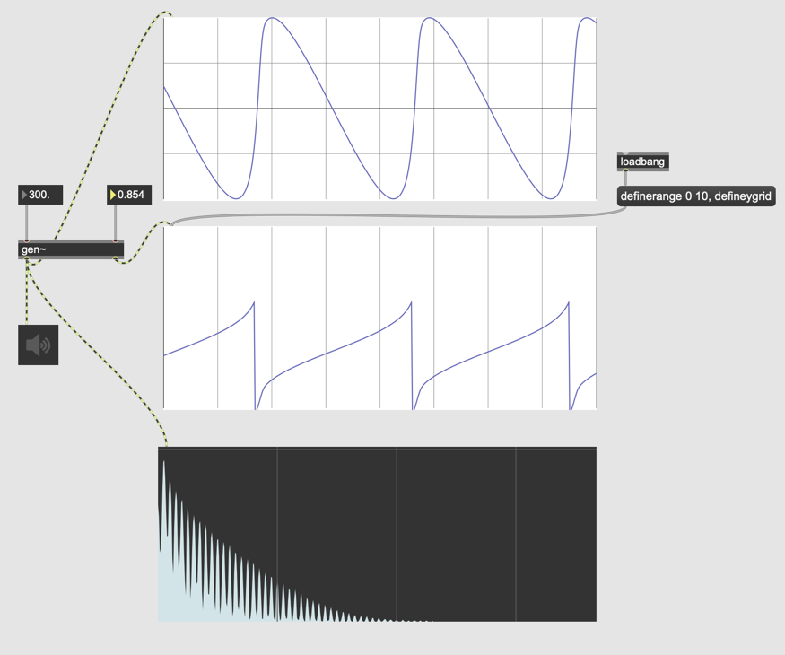
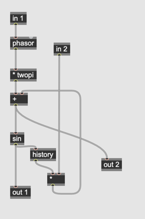

# Klasse8 

## CodeMode

## Weitere Synthese mit gen~

### FM 

### MMFM (Multiple Modulator Frequency Modulation)

### FBFM (Feedback Frequency Modulation)

### Karplus-strong 

### WaveGuide-Synthese 

### Phase-Distortion Synthese

