# Klasse10

### Reverbration

### Manfred Schröeders "FreeVerb"

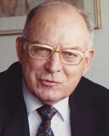 
Urheber von Digital Reverb

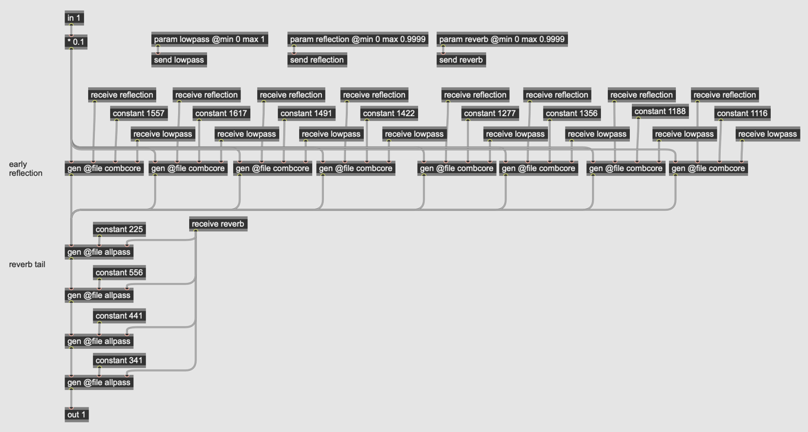

### Kammfilter in gen

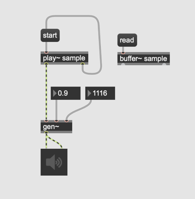
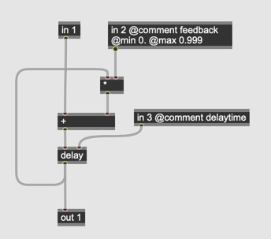

### Kammfilter mit Tiefpass

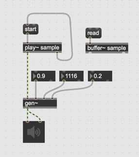
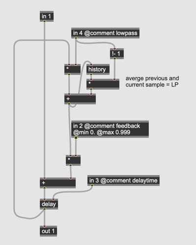

### Array von 8x Kammfilter

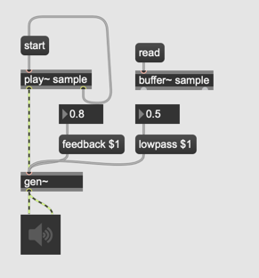

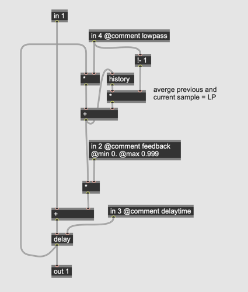

Warum sind Delay Time 1157, 1617, 1491 ... etc ?
Sie sind alle teilerfremd deshalb sind Delays immer unsynchronisiert (nicht gleichzeitig gespielt).

### Allpass

An allpass filter is a peculiar signal processor. For steady-state tones fed into it, the allpass filter passes all frequencies equally well with no change in ampplitude -- hence its name.

Thus, it is said that an allpass filter has a flat frequency response throughout the audio bandwidth. However, the allpass also imposes a frequency-dependent phase shift on the incoming signal. it delays various frequency regions by different amounts.

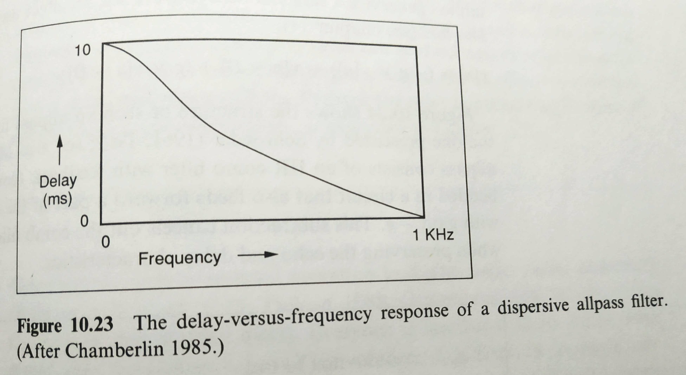

### Der Unterschied Kamm vs Allpass

#### Comb
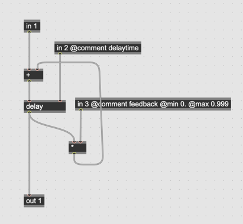
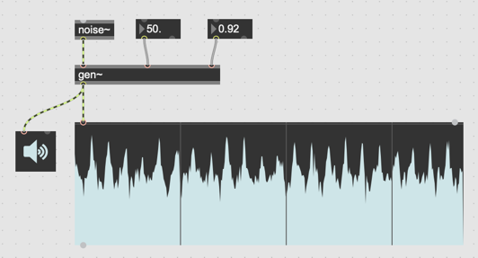

#### Allpass
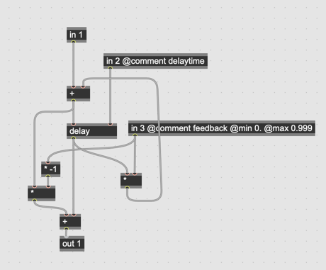
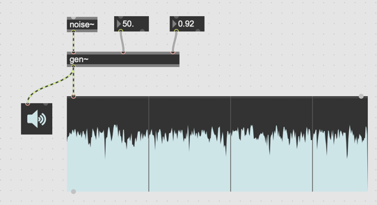

Phasenausl￿￿ösung mit * -feedback

#### Array von Allpass

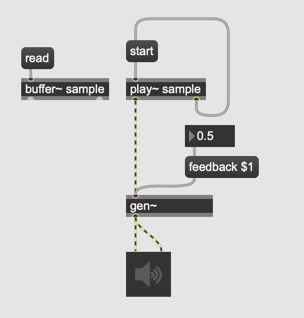
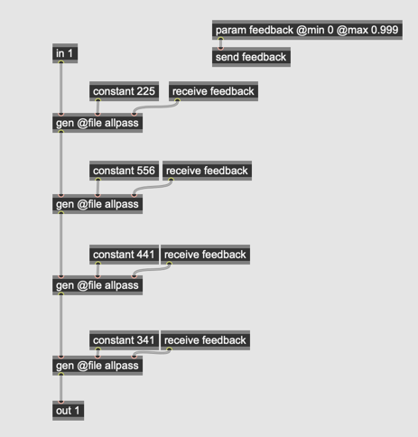
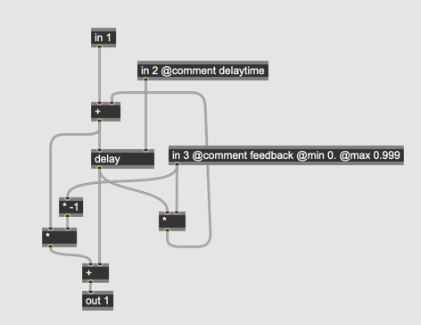

#### Kombination

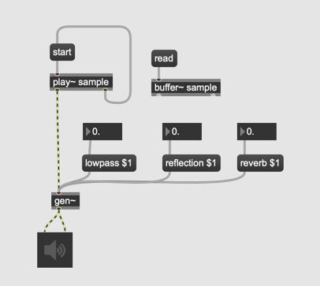
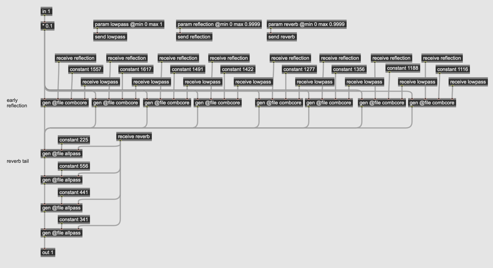

#### "Room Size" parameter

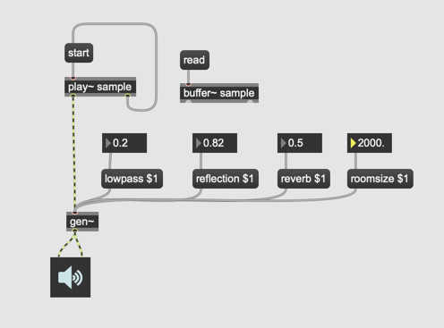
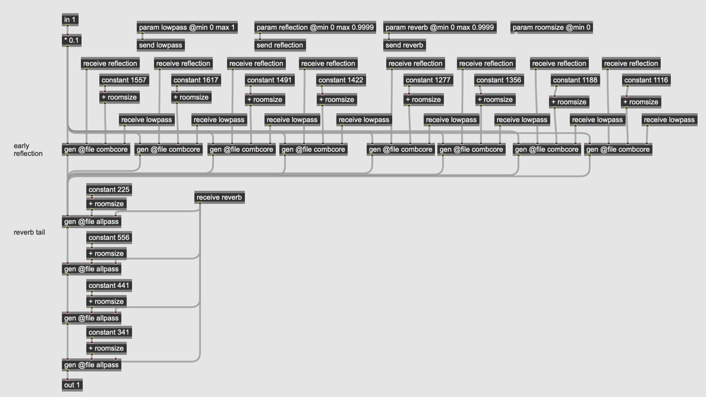

