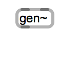

# Software 1 

WS 2016 
Mo. 12:30-14:00 @ SFEM

Dr. Chikashi Miyama 

Max/MSP wird heute im Bereich der elektronischen Komposition sehr häufig verwendet und hat sich in den letzten Jahren zum Standard für Echtzeit-Medienverarbeitung etabliert. In visuellen Flussdiagrammen werden Module von unterschiedlichsten Funktionen miteinander verknüpft, um Programme zur Verarbeitung von Audio und Video zu erstellen. Der Kurs vermittelt den Teilnehmern mit der Grundkenntnis von Max/MSP weiterführende Kenntnisse und verschiedene praktische Anwendungstechniken der Software. 

Das Hauptthema von WS 2016 ist gen~, ein neues Objekt, das mehrere besondere Funktionen anbietet. 

